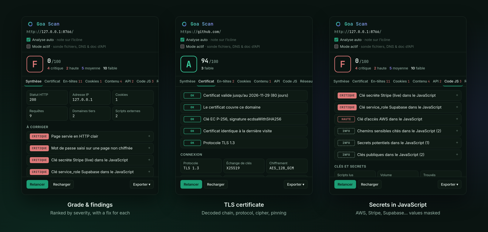

<p align="center">
  
</p>

<p align="center">
  <a href="https://github.com/AbrahamOP/goa-scan/actions/workflows/ci.yml"></a>
  
  
  
  <a href="LICENSE"></a>
</p>

<h3 align="center">L'audit de sécurité d'une page web, en un clic.<br>Noté de A à F, expliqué, et 100&nbsp;% local.</h3>

<p align="center">
  <a href="#fonctionnalités">Fonctionnalités</a> ·
  <a href="#installation">Installation</a> ·
  <a href="#confidentialité">Confidentialité</a> ·
  <a href="README.md">English</a>
</p>

<br>

<p align="center">
  
</p>

<br>

Goa Scan lit ce que la page envoie à votre navigateur — certificat, en-têtes, cookies,
appels d'API, JavaScript — et en tire une note, des constats classés par gravité et un
correctif pour chacun. Pensé pour les développeurs qui vérifient leur propre site, et
pour les pentesteurs et chasseurs de bug bounty qui veulent une reconnaissance passive
sans quitter l'onglet.

## Fonctionnalités

<table>
  <tr>
    <td width="33%" valign="top"><b>Certificat TLS</b><br><sub>Chaîne décodée, expiration, clés faibles, version TLS et chiffrement. Alerte si le certificat d'un site change.</sub></td>
    <td width="33%" valign="top"><b>En-têtes de sécurité</b><br><sub>CSP, HSTS, clickjacking, nosniff, Referrer-Policy, Permissions-Policy, COOP, CORS.</sub></td>
    <td width="33%" valign="top"><b>Cookies</b><br><sub>Secure, HttpOnly, SameSite. Les valeurs ne sont jamais lues.</sub></td>
  </tr>
  <tr>
    <td valign="top"><b>Appels d'API</b><br><sub>Chaque appel fetch, XHR et WebSocket regroupé par endpoint, avec statut et authentification.</sub></td>
    <td valign="top"><b>Secrets dans le JavaScript</b><br><sub>~30 formats de clés : AWS, Stripe, GitHub, OpenAI, Supabase… Masqués dès la détection.</sub></td>
    <td valign="top"><b>Endpoints et paramètres</b><br><sub>Chemins et noms de paramètres cachés dans les bundles, recoupés avec les vrais appels.</sub></td>
  </tr>
  <tr>
    <td valign="top"><b>Bibliothèques vulnérables</b><br><sub>Base retire.js embarquée, ~485 CVE, aucun appel réseau.</sub></td>
    <td valign="top"><b>Contenu de la page</b><br><sub>Contenu mixte, formulaires en clair, scripts sans SRI, jetons dans le stockage.</sub></td>
    <td valign="top"><b>Mode actif</b> <sub>(opt-in)</sub><br><sub><code>.git</code> / <code>.env</code> exposés, doc OpenAPI publique, CAA, DNSSEC, SPF, DMARC.</sub></td>
  </tr>
</table>

Note sur l'icône, rapport en pleine page, export Markdown, PDF ou JSON.

<details>
<summary><b>Liste complète des contrôles</b></summary>
<br>

- **Certificat** — sujet, émetteur, validité, clé, signature, empreinte SHA-256, SAN,
  DV/OV/EV, SCT ; expiré ou bientôt, nom non couvert (jokers compris), auto-signé,
  SHA-1/MD5, RSA < 2048 / EC < 256, durée > 398 jours, intermédiaire expiré ; TLS
  1.0/1.1, RSA statique, CBC, Certificate Transparency ; erreurs `ERR_CERT_*`.
  Empreinte épinglée par site : un changement qui ne ressemble pas à un renouvellement
  déclenche une alerte.
- **Transport** — HTTPS, redirection HTTP → HTTPS, HSTS (durée, includeSubDomains,
  preload), contenu mixte actif et passif, WebSocket en clair.
- **En-têtes** — CSP (absente, Report-Only, `unsafe-inline`, `unsafe-eval`, jokers,
  `object-src`, `base-uri`, politiques multiples), `frame-ancestors` / X-Frame-Options,
  `nosniff`, Referrer-Policy, Permissions-Policy, COOP, CORS `*`, X-XSS-Protection
  obsolète. En-têtes bruts et chaîne de redirections.
- **Exposition** — version du serveur, `X-Powered-By`, `meta generator`, bibliothèques
  JS vulnérables, `security.txt`.
- **Cookies** — Secure, HttpOnly sur les cookies de session, SameSite.
- **Contenu** — mot de passe sur page HTTP, formulaire posté en clair ou vers un autre
  site, scripts tiers sans SRI, iframes tierces sans sandbox, jetons dans le Web
  Storage (noms de clés seulement), commentaires HTML sensibles, e-mails exposés,
  scripts inline et gestionnaires `on*`.
- **API** — méthode, endpoint (`/users/123` → `/users/:id`), statut, type de réponse,
  schéma d'authentification ; jetons ou clés dans l'URL, HTTP Basic, 5xx ;
  documentation OpenAPI/Swagger publique (mode actif).
- **Code JavaScript** — secrets (AWS, Stripe, GitHub, GitLab, OpenAI, Anthropic, Google,
  Slack, Discord, Telegram, SendGrid, Twilio, Mailgun, npm, Hugging Face, Shopify, clés
  privées, JWT…), clés publiques par conception classées à part ; endpoints et
  paramètres cités dans le code, chemins sensibles (`/admin`, `/actuator`…).
- **Réseau et technologies** — requêtes, domaines tiers, traqueurs, IP du serveur ;
  serveur, CDN, CMS et frameworks avec leur version.

</details>

<details>
<summary><b>Calcul de la note</b></summary>
<br>

100 moins une pénalité par constat — critique 25, haute 12, moyenne 6, faible 2,
info 0. Une page servie en HTTP est plafonnée à 40.

| A | B | C | D | E | F |
|:-:|:-:|:-:|:-:|:-:|:-:|
| ≥ 90 | ≥ 75 | ≥ 60 | ≥ 45 | ≥ 30 | < 30 |

</details>

## Installation

1. Télécharger ou cloner ce dépôt.
2. Ouvrir `chrome://extensions` et activer le **mode développeur**.
3. **Charger l'extension non empaquetée** → sélectionner le dossier, puis épingler Goa Scan.

Chrome, Edge, Brave, Opera et les autres navigateurs Chromium, version 116 ou plus.

## Confidentialité

Pas de compte, pas de serveur, pas de mouchard. En analyse passive, les seules requêtes
émises vont **vers le site analysé**. Valeurs des cookies et secrets sont masqués,
jamais exportés en clair. Les outils externes (SSL Labs, VirusTotal…) ne reçoivent le
domaine qu'au clic sur leur lien. Détail dans [PRIVACY.md](PRIVACY.md).

<details>
<summary><b>Permissions</b></summary>
<br>

| Permission | Pourquoi |
|---|---|
| `webRequest` + `<all_urls>` | Lire les en-têtes de réponse et lister les requêtes de la page. Rien n'est bloqué ni modifié. |
| `scripting` | Inspecter le DOM de l'onglet au moment de l'analyse. |
| `cookies` | Lire les attributs des cookies, pas leur valeur. |
| `storage` | Capture par onglet et empreintes de certificats épinglées, sur votre appareil. |
| `debugger` *(optionnelle)* | Seul moyen par lequel Chrome expose le certificat TLS à une extension. |

Chrome ne donne pas le certificat aux extensions et leur ferme le domaine DevTools
`Security`. Goa Scan s'attache à l'onglet ~0,5 s, appelle `Network.getCertificate`,
décode la chaîne DER localement, lit `securityDetails` sur une requête sonde `HEAD`
sans cookies, puis se détache. Chrome affiche brièvement un bandeau « a commencé le
débogage ». Sans cette permission, tout le reste fonctionne.

</details>

<details>
<summary><b>Limites</b></summary>
<br>

- Un certificat refusé affiche la page d'erreur de Chrome, à laquelle rien ne peut
  s'attacher : seul le code `ERR_CERT_*` est connu et la note tombe à F.
- Si la CSP de la page bloque la requête sonde, seule la chaîne est affichée.
- Page chargée avant l'extension ou restaurée du cache : bouton *Recharger*.
- Pages `chrome://`, Chrome Web Store et visionneuse PDF : non inspectables.
- Les applications monopage gardent la capture du document initial.

</details>

<details>
<summary><b>Développement</b></summary>
<br>

Vanilla JS, aucune dépendance, aucun build. Les règles sont des fonctions pures testées
sous Node ; les tests de bout en bout pilotent un vrai Chromium.

```bash
node --test tests/*.test.js     # tests unitaires
node tools/package.mjs          # zip prêt pour le store dans dist/
```

Voir [CONTRIBUTING.md](CONTRIBUTING.md).

</details>

<br>

<p align="center">
  <a href="CONTRIBUTING.md">Contribuer</a> ·
  <a href="SECURITY.md">Sécurité</a> ·
  <a href="CHANGELOG.md">Changelog</a> ·
  <a href="LICENSE">Licence MIT</a>
  <br><br>
  <sub>Données de vulnérabilités issues de <a href="https://github.com/RetireJS/retire.js">retire.js</a> (Apache-2.0).<br>
  Conçu par GoaCloud — <i>le studio des outils souverains.</i></sub>
</p>
