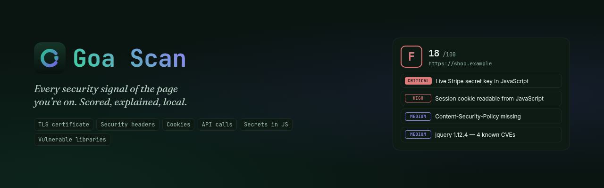
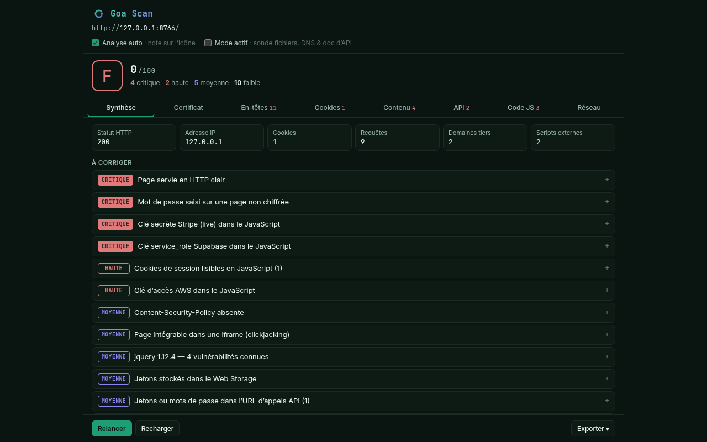
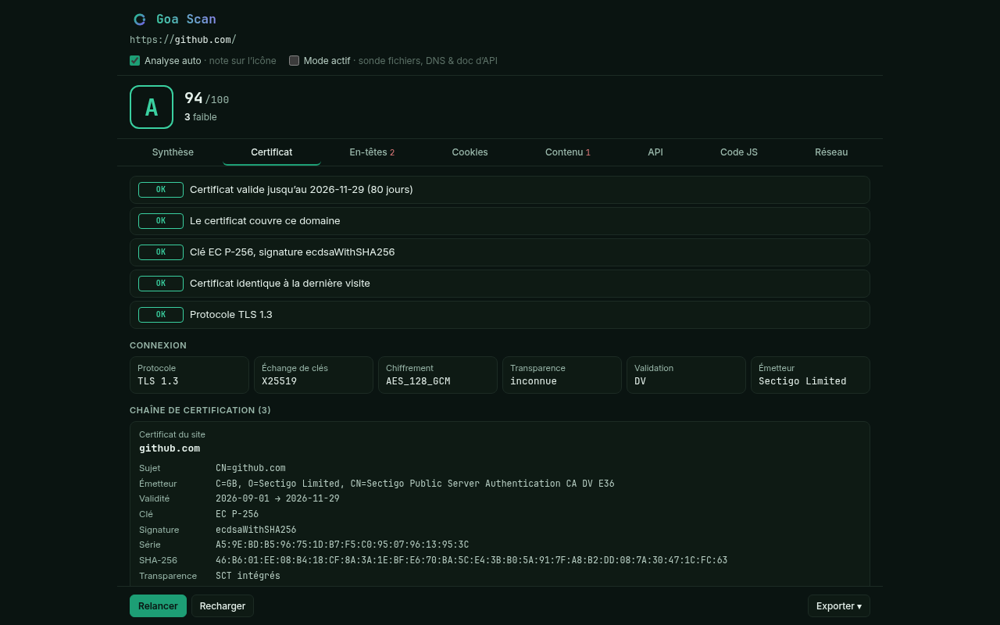
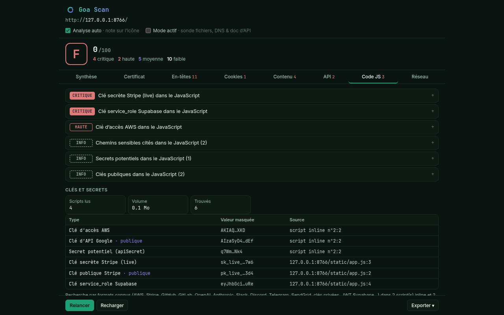
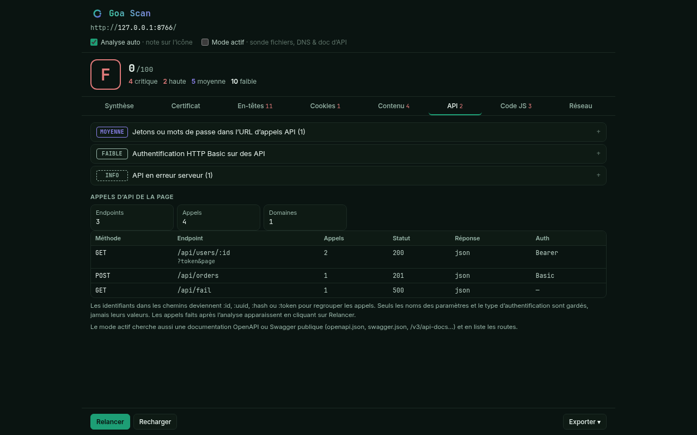

<p align="center">
  
</p>

<p align="center">
  <a href="https://github.com/AbrahamOP/goa-scan/actions/workflows/ci.yml"></a>
  
  
  
  
  <a href="LICENSE"></a>
</p>

<p align="center">
  <b>English</b> · <a href="README.fr.md">Français</a>
</p>

**Goa Scan** is a browser extension that audits the security of any web page in one
click. It reads the TLS certificate, the security headers, the cookies, the API calls
and the JavaScript the page ships, then gives it a grade from **A to F** with every
finding ranked by severity and a fix for each one.

Everything runs **inside your browser**. No account, no server, no telemetry.

- **Developers** check their own site before shipping: missing CSP, weak cookies, a
  secret left in a bundle.
- **Bug bounty hunters and pentesters** get passive recon for free: API endpoints,
  parameters and keys hidden in the JavaScript, vulnerable libraries, exposed docs.
- **Curious users** see at a glance whether the site they are about to trust is well
  configured, and get warned if its certificate suddenly changes.

<p align="center">
  
  
  
  
</p>

> The interface is currently in French. Findings, exports and the grading logic are
> the same whatever your browser language.

## Features

| | What Goa Scan checks |
|---|---|
| 🔒 **TLS certificate** | Full chain decoded locally (subject, issuer, validity, key, signature, SHA-256 fingerprint, SANs, DV/OV/EV, SCTs). Expiry, hostname match (wildcards included), self-signed, SHA-1/MD5, weak RSA/EC keys, lifetime > 398 days. Connection: TLS version, key exchange, cipher, Certificate Transparency. **Alerts you when a site's certificate changes** between two visits without looking like a renewal. |
| 🧱 **Security headers** | Content-Security-Policy (missing, report-only, `unsafe-inline`, `unsafe-eval`, wildcards, `object-src`, `base-uri`), HSTS (max-age, includeSubDomains, preload), clickjacking (`frame-ancestors` / X-Frame-Options), `nosniff`, Referrer-Policy, Permissions-Policy, COOP, CORS `*`. Raw headers and redirect chain included. |
| 🍪 **Cookies** | `Secure`, `HttpOnly` on session cookies, `SameSite` — **cookie values are never read**. |
| 📄 **Page content** | Mixed content, passwords on HTTP, forms posting in clear or cross-site, third-party scripts without SRI, unsandboxed iframes, tokens in localStorage/sessionStorage, sensitive HTML comments, exposed e-mails. |
| 🔌 **API calls** | Every fetch, XHR and WebSocket call of the page, grouped by endpoint (`/users/123` → `/users/:id`), with method, status, response type and auth scheme (Bearer, Basic, API key). Tokens or passwords in URLs, 5xx errors. |
| 🔑 **Secrets in JavaScript** | ~30 key formats detected in inline and external scripts, lazy-loaded chunks included: AWS, Stripe, GitHub, GitLab, OpenAI, Anthropic, Google, Slack, Discord, Twilio, SendGrid, npm, Hugging Face, private keys, JWTs (Supabase `service_role` = critical). Public-by-design keys are told apart. **Values are masked on detection.** |
| 🧭 **Endpoints & parameters in JS** | URLs, paths and template strings (`` `/api/x/${id}` ``) mentioned in the code, cross-checked with the calls actually made — the rest is attack surface your browsing did not touch. Query and form parameter names, sorted by frequency. |
| 📦 **Vulnerable libraries** | Embedded [retire.js](https://github.com/RetireJS/retire.js) database (~75 components, ~485 CVEs), matched by global variable and by script URL. No network call. |
| 🛰️ **Network & stack** | Requests, third-party domains, known trackers, server IP. Server, CDN, CMS and framework detection with versions. |
| 🧪 **Active mode** *(opt-in)* | Exposed files (`/.git`, `/.env`, `/server-status`…) confirmed by content, public OpenAPI/Swagger docs and their routes, DNS audit (CAA, DNSSEC, SPF, DMARC) over DNS-over-HTTPS. |

Plus: **automatic grade on the toolbar icon**, a full-page report, and **export to
Markdown, printable HTML/PDF or JSON**.

## Privacy by design

Goa Scan has no backend. In passive mode the only requests it sends go **to the site
you are analysing** (`/.well-known/security.txt`, a header fallback, re-reading its
scripts without cookies). Nothing is sent to the author or to any third party.

- Cookie values and discovered secrets are masked and never exported in clear.
- "Go further" links (SSL Labs, securityheaders.com, VirusTotal…) only send the domain
  **when you click them**.
- Active mode is off by default; when enabled, it probes the analysed site and queries
  its public DNS records through Cloudflare DoH.

Full policy: [PRIVACY.md](PRIVACY.md).

## Install

**From source** (until the Chrome Web Store listing is live):

1. Download or clone this repository.
2. Open `chrome://extensions` and turn on **Developer mode**.
3. Click **Load unpacked** and select the folder.
4. Pin Goa Scan, open any website, click the icon.

Works on Chrome, Edge, Brave, Opera and other Chromium browsers (116+).

## How the grade works

Score = 100 minus a penalty per finding: critical 25, high 12, medium 6, low 2, info 0.
A page served over plain HTTP is capped at 40.
**A** ≥ 90 · **B** ≥ 75 · **C** ≥ 60 · **D** ≥ 45 · **E** ≥ 30 · **F** below.

## Permissions

| Permission | Why |
|---|---|
| `webRequest` + `<all_urls>` | Read the response headers of the page and list its requests. Read-only: nothing is blocked or modified. |
| `scripting` | Inspect the DOM of the tab at analysis time. |
| `cookies` | Read cookie attributes (`Secure`, `HttpOnly`, `SameSite`) — not their values. |
| `storage` | Per-tab network capture (`storage.session`) and pinned certificate fingerprints (`storage.local`). |
| `debugger` *(optional)* | The only way Chrome exposes a TLS certificate to an extension. Requested on first use. |

<details>
<summary><b>Why the <code>debugger</code> permission for the certificate?</b></summary>

Chrome does not expose the certificate to extensions (no equivalent of Firefox's
`getSecurityInfo`), and the DevTools `Security` domain is closed to them. Goa Scan uses
the `Network` domain instead, which is allowed:

1. `chrome.debugger.attach` to the tab for the duration of the analysis (~0.5 s);
2. `Network.getCertificate` returns the DER chain, decoded locally by `cert.js`
   (a minimal ASN.1 decoder, no dependency);
3. a `HEAD` probe to the same origin, without cookies, exposes `securityDetails`
   (protocol, key exchange, cipher, CT compliance);
4. detach.

Chrome briefly shows a "Goa Scan started debugging this browser" bar. Without this
permission, everything else still works.
</details>

## FAQ

**Is it a vulnerability scanner?** By default it is a passive analyser: it reads what
the page already sends to your browser. Active mode sends a handful of requests to the
site you are on. Only use it on sites you own or are authorised to test.

**Does it slow down browsing?** The automatic grade runs once per page load, after the
page is complete. It can be turned off from the popup.

**Why no Firefox version?** The certificate and request capture rely on Chromium APIs.
A port is possible; contributions are welcome.

## Limitations

- **Rejected certificates** (expired, self-signed…): Chrome shows its own error page,
  which nothing can attach to. Only the `ERR_CERT_*` code is known; the grade drops to F.
- **TLS parameters**: if the page's CSP blocks the probe (`connect-src`), only the chain
  is shown.
- **Pages loaded before the extension** or restored from cache: requests were not seen.
  The *Reload* button fixes it.
- **Protected pages** (`chrome://`, Chrome Web Store, PDF viewer) cannot be inspected.
- Single-page apps that change URL without reloading keep the capture of the first document.

## Development

Vanilla JavaScript, no dependency, no build step.

```
manifest.json         MV3 declaration
background.js         service worker: network capture, auto-grade badge, certificate pinning
collector.js          functions injected in the page (DOM, globals)
cert.js               X.509 (DER) decoder: subject, issuer, key, SANs, policies, SCTs
checks.js             analysis rules, pure functions (tested under Node)
secrets.js            secret, endpoint and parameter extraction from JS
vulndb.js             retire.js matching (version → CVE)
vendor/vulndb-data.js embedded retire.js database (built by tools/build-vulndb.mjs)
probes.js             active mode: file probes + DNS-over-HTTPS
export.js             Markdown and printable HTML reports
popup.*               UI — popup and full report (popup.html?tab=<id>)
```

```bash
node --test tests/*.test.js     # rules, X.509 decoder, secrets, retire.js, exports
node tools/build-vulndb.mjs     # refresh the retire.js database
node tools/package.mjs          # → dist/goa-scan-<version>.zip, checked against store rules
```

End-to-end tests drive a real Chromium with Puppeteer against a local trap page and
real sites — see [`tests/e2e/`](tests/e2e) and [CONTRIBUTING.md](CONTRIBUTING.md).

## Contributing

Bug reports, false positives and new checks are welcome. Read
[CONTRIBUTING.md](CONTRIBUTING.md) first; security issues go through
[SECURITY.md](SECURITY.md). Release notes: [CHANGELOG.md](CHANGELOG.md).

## License

[MIT](LICENSE). The embedded vulnerability database is derived from
[RetireJS/retire.js](https://github.com/RetireJS/retire.js) (Apache-2.0).

<p align="center"><sub>Built by GoaCloud — <i>the studio for sovereign tools.</i></sub></p>
